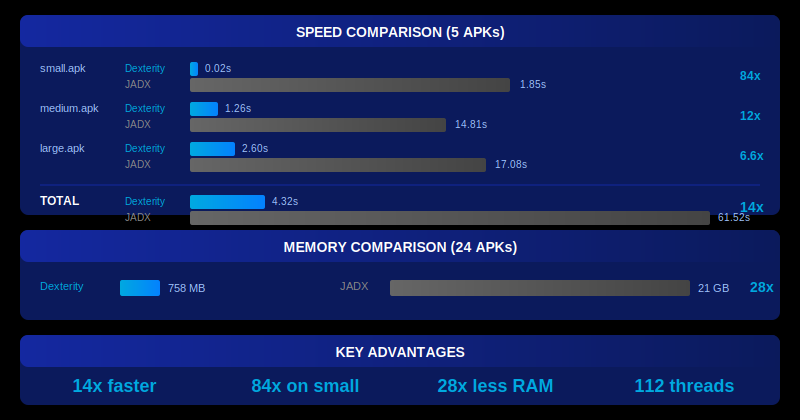

<p align="center">
<pre>
      ____  _______  _________ ______ ____  ____________  __
     / __ \/ ____/ |/ /_  __// ____// __ \/  _/_  __/\ \/ /
    / / / / __/  |   / / /  / __/  / /_/ // /  / /    \  /
   / /_/ / /___ /   | / /  / /___ / _, _// /  / /     / /
  /_____/_____//_/|_|/_/  /_____//_/ |_/___/ /_/     /_/

           High-performance Android decompiler written in Rust
</pre>
</p>

<p align="center">
  <a href="docs/LICENSE"></a>
  <a href="https://www.rust-lang.org/"></a>
</p>

---

A high-performance Android DEX/APK decompiler written in Rust, producing Java source code compatible with [JADX](https://github.com/skylot/jadx) output.

**Goal:** Correct decompilation close to JADX
**Status:** ~78% JADX Parity | Grade: C+ | GAP-01, GAP-02 FIXED Dec 24 - see [QUALITY_STATUS.md](docs/QUALITY_STATUS.md)

> **Update (Dec 24, 2025):** Fixed GAP-01 (SSA variable mapping) and GAP-02 (iterator for-each loop detection). Parity improved from 75% to 78%.

## Performance

<p align="center">
  
</p>

<details>
<summary>Detailed benchmark table</summary>

| APK | Dexterity (112t) | JADX (56t) | Speedup |
|-----|------------------|------------|---------|
| small.apk | 0.022s | 1.85s | **84x** |
| medium.apk | 1.26s | 14.81s | **11.8x** |
| large.apk | 2.60s | 17.08s | **6.6x** |
| badboy.apk | 0.23s | 14.07s | **61x** |
| badboy-x86.apk | 0.21s | 13.71s | **65x** |
| **Total** | **4.32s** | **61.52s** | **14.2x** |

*Benchmarked on 100GB RAM disk (Dec 22, 2025)*

</details>

### Batch Processing Optimization

For processing many APKs, parallel workers outperform single-threaded max-core usage:

| Config | Workers | Threads/Worker | Time (100 APKs, 1.4GB) |
|--------|---------|----------------|------------------------|
| Sequential | 1 | 112 | 3m31s |
| **Optimal** | **7** | **16** | **2m0s** |
| Over-parallel | 10 | 11 | 2m15s |

**Recommendation:** On a 56-core system (112 threads), use **7 parallel workers with 16 threads each**. This is 76% faster than processing one APK at a time with all threads. Too many workers (10+) starves each APK of threads.

See [PERFORMANCE.md](docs/PERFORMANCE.md) for detailed benchmarks

## Quick Start

```bash
# Build
cd crates
cargo build --release -p dexterity-cli

# Decompile an APK
./target/release/dexterity -d output/ app.apk

# With deobfuscation
./target/release/dexterity --deobf -d output/ app.apk

# Export as Gradle project
./target/release/dexterity -e -d output/ app.apk
```

## Key Features

- **Input formats:** APK, DEX, JAR, AAR, AAB, XAPK, APKM (APKS not yet supported)
- **Deobfuscation:** ProGuard mappings, JOBF files
- **Kotlin support:** ~60% parity (D Grade) - **CRITICAL ISSUES:**
  - Class modifiers: `/* data */`, `/* sealed */`, `/* value */` - works
  - Function modifiers: `/* suspend */`, `/* inline */`, `/* operator */` - works
  - **BROKEN:** d2 metadata field names parsed but NOT APPLIED (e.g., `onBalloonClickListener` instead of `context`)
  - **BROKEN:** Enum constants as raw integers (`1056964608` instead of `ALIGN_BALLOON`)
  - **BROKEN:** Kotlin assertion strings wrong in output
- **Control flow:** OR condition merging (`a || b` patterns), short-circuit evaluation
- **Throws declarations:** Parse `dalvik/annotation/Throws` (41.7% parity, 3x improvement)
- **Resource resolution:** `R.layout.activity_main` (enabled by default)
- **Drop-in JADX replacement:** Same CLI arguments

## Documentation

| Document | Description |
|----------|-------------|
| [Documentation Index](docs/INDEX.md) | Full documentation index |
| [CLI Reference](docs/CLI_REFERENCE.md) | All command-line options |
| [Performance](docs/PERFORMANCE.md) | Detailed benchmarks |
| [Quality Status](docs/QUALITY_STATUS.md) | Current quality grades |
| [Architecture](docs/ARCHITECTURE.md) | Crate structure |
| [Design Decisions](docs/DESIGN_DECISIONS.md) | Framework filtering, Compose detection |
| [Known Issues](docs/KNOWN_ISSUES.md) | Limitations and workarounds |
| [Roadmap](docs/ROADMAP.md) | Future work |

## Architecture

<p align="center">
  
</p>

| Crate | Purpose | Claimed | Actual | Notes |
|-------|---------|---------|--------|-------|
| dexterity-dex | DEX binary parsing | 100% | **A+** | Verified |
| dexterity-ir | Intermediate representation | 88% | **C (70%)** | Region ordering differs |
| dexterity-passes | Decompilation passes | 85% | **C+ (75%)** | Missing CollectConstValues effect |
| dexterity-codegen | Java source generation | 92% | **C+ (75%)** | Field names, enum inits wrong |
| dexterity-resources | Resource decoding | 100% | **A+** | 1:1 JADX parity verified |
| dexterity-deobf | Deobfuscation | 95% | **B- (80%)** | Kotlin rename hints ignored |
| dexterity-kotlin | Kotlin metadata | 70% | **D (60%)** | d2 field names NOT APPLIED |
| dexterity-llm-postproc | LLM post-processing | N/A | - | |
| dexterity-qa | Quality assurance tooling | N/A | - | |
| dexterity-py | Python bindings | N/A | - | |
| dexterity-cli | CLI application | 95% | **A** | CLI works fine |

*Honest assessment based on Balloon.java comparison (Dec 23, 2025). Overall grade: **C+ (~75%)**. Output differs visibly from JADX on Kotlin files. See [Quality Status](docs/QUALITY_STATUS.md).*

### Critical Bugs (Balloon.java Comparison Dec 23, 2025)

| Bug | Example | Impact |
|-----|---------|--------|
| Type descriptor in field names | `private final h Lcom/skydoves/balloon/d;;` | **P0** - Syntax error |
| Kotlin d2 field names not applied | `onBalloonClickListener` instead of `context` | **P0** - Wrong names |
| Enum constants as raw integers | `1056964608` instead of `ALIGN_BALLOON` | **P0** - Unreadable |
| Switch case ordering reversed | Cases appear in reverse order from JADX | **P1** - Confusing |
| Kotlin assertion strings wrong | `"resources"` instead of `"binding.balloonCard"` | **P2** - Minor |

See [JADX_PASSES_PARITY_AUDIT.md](docs/JADX_PASSES_PARITY_AUDIT.md) for full comparison and [JADX_CLONE_TASKS.md](docs/JADX_CLONE_TASKS.md) for fix tasks.

### Recent JADX Pass Clones (Dec 2025)

| Pass | JADX Lines | Description |
|------|------------|-------------|
| `block_exception_handler` | 640 | Exception CFG construction with splitter blocks |
| `debug_info` | 442 | Debug info attach + apply (variable names/types) |
| `switch_over_string` | 479 | Java 7+ string switch restoration |
| `synchronized_region` | 184 | Synchronized block handling |
| `fix_multi_entry_loops` | 125 | CFG normalization for loops |
| `process_try_catch_regions` | 127 | Try-catch region wrapping |
| `exc_handlers_region` | 153 | Exception handler regions |
| `class_modifier` | ~300 | Synthetic element hiding |
| `inline_methods` | ~300 | Method inlining |
| `signature_processor` | 337 | Generic type signatures |

See [JADX_CLONE_TASKS.md](docs/JADX_CLONE_TASKS.md) for complete clone specifications with JADX line references.

## Sample Output

```java
package io.github.skylot.android.smallapp;

import android.app.Activity;
import android.os.Bundle;
import android.util.Log;

public class MainActivity extends Activity {
    @Override
    public void onCreate(Bundle savedInstanceState) {
        super.onCreate(savedInstanceState);
        setContentView(R.layout.activity_main);
        Log.i("SmallApp", "Hello");
    }
}
```

## Reference Output Examples

Comparison examples of Dexterity vs JADX decompilation output (~8,858 Java files total):

- **Small APK** (1 file)
  - [Dexterity output](output/dexterity/small/sources/) | [JADX output](output/jadx/small/sources/)

- **Medium APK** (2,890 files)
  - [Dexterity output](output/dexterity/medium/sources/) | [JADX output](output/jadx/medium/sources/)

- **Large APK** (5,901 files)
  - [Dexterity output](output/dexterity/large/sources/) | [JADX output](output/jadx/large/sources/)

- **Badboy APK** (53 files)
  - [Dexterity output](output/dexterity/badboy/sources/) | [JADX output](output/jadx/badboy/sources/)

- **Badboy-x86 APK** (13 files)
  - [Dexterity output](output/dexterity/badboy-x86/sources/) | [JADX output](output/jadx/badboy-x86/sources/)

Notable reference file: [o/a/b.java](output/dexterity/large/sources/o/a/b.java) (Dexterity) vs [o/a/b.java](output/jadx/large/sources/o/a/b.java) (JADX)

## License

Apache-2.0 (same as JADX)

## Credits

- [skylot/jadx](https://github.com/skylot/jadx) - The original JADX project

---

<p align="center">
  <b>Reference Implementation:</b> Java JADX v1.5.3 at <code>jadx-fast/</code>
</p>
