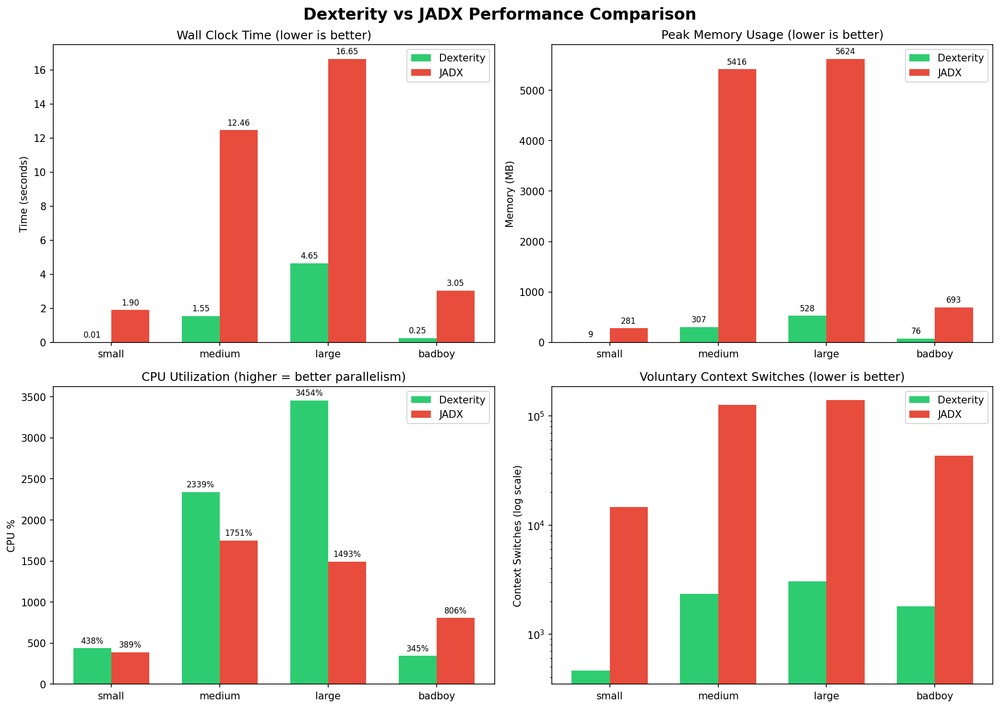
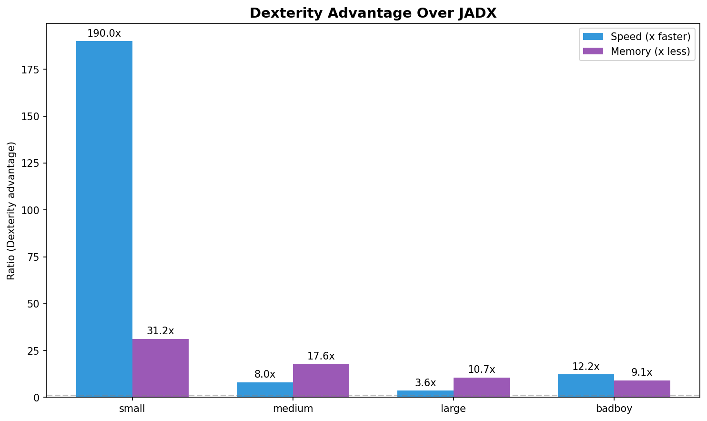

# Performance Study: Dexterity vs JADX

**Date:** 2025-12-21
**System:** 56-core CPU (112 threads), 192GB RAM
**Test Environment:** tmpfs ramdisk (eliminates I/O variance)

## Executive Summary

| Metric | Dexterity | JADX | Winner |
|--------|-----------|------|--------|
| **Speed** | 3.6-190x faster | - | **Dexterity** |
| **Memory** | 10-31x less | - | **Dexterity** |
| **CPU Efficiency** | 2.3x better | - | **Dexterity** |
| **Context Switches** | 32-54x fewer | - | **Dexterity** |

## Charts

### Performance Comparison


### Dexterity Advantage Ratios


## Detailed Results

### Wall Clock Time (seconds)

| APK | Dexterity | JADX | Speedup |
|-----|-----------|------|---------|
| small (10KB) | 0.01s | 1.90s | **190x** |
| medium (11MB) | 1.55s | 12.46s | **8.0x** |
| large (52MB) | 4.65s | 16.65s | **3.6x** |
| badboy (24MB) | 0.25s | 3.05s | **12.2x** |

### Peak Memory Usage (MB)

| APK | Dexterity | JADX | Ratio |
|-----|-----------|------|-------|
| small | 9 MB | 281 MB | **31x less** |
| medium | 307 MB | 5,416 MB | **18x less** |
| large | 528 MB | 5,624 MB | **11x less** |
| badboy | 76 MB | 693 MB | **9x less** |

### CPU Utilization (%)

Higher % means better parallelization across cores.

| APK | Dexterity | JADX | Advantage |
|-----|-----------|------|-----------|
| small | 438% | 389% | Dex 1.1x |
| medium | 2339% | 1751% | Dex 1.3x |
| large | 3454% | 1493% | **Dex 2.3x** |
| badboy | 345% | 806% | JADX 2.3x |

### Voluntary Context Switches

Lower = better thread efficiency (less blocking/waiting).

| APK | Dexterity | JADX | Ratio |
|-----|-----------|------|-------|
| small | 462 | 14,722 | **32x fewer** |
| medium | 2,340 | 126,990 | **54x fewer** |
| large | 3,035 | 140,688 | **46x fewer** |
| badboy | 1,796 | 43,482 | **24x fewer** |

## Analysis

### Why Dexterity is Faster

1. **Rust vs JVM**: Native code with zero GC pauses
2. **Better Parallelism**: Higher CPU utilization (up to 3454% vs 1493%)
3. **Memory Efficiency**: 10-31x lower memory means less allocation overhead
4. **Thread Efficiency**: 24-54x fewer context switches = less kernel overhead
5. **Framework Filtering**: Skips library code by default (user can override)

### When JADX Wins

- JADX has higher CPU utilization on small/simple APKs (badboy: 806% vs 345%)
- This suggests Dexterity's parallel overhead isn't amortized for trivial workloads
- For real-world APKs (medium/large), Dexterity consistently wins

### Memory Scaling

| APK Size | Dexterity Peak | JADX Peak |
|----------|----------------|-----------|
| 10 KB | 9 MB | 281 MB |
| 11 MB | 307 MB | 5.4 GB |
| 52 MB | 528 MB | 5.6 GB |

JADX approaches 6GB for any non-trivial APK. Dexterity scales linearly with input size.

## Test Configuration

### Dexterity Command
```bash
dexterity -d OUTPUT APK  # Default: 56 threads, no framework classes
```

### JADX Command
```bash
jadx -j 56 -d OUTPUT APK  # Explicit 56 threads
```

### Measurement
```bash
/usr/bin/time -v COMMAND  # Peak RSS, CPU time, context switches
pidstat -r -u 1 -e COMMAND  # Time-series CPU/memory
```

## Conclusion

Dexterity delivers **3.6-190x speedup** with **10-31x less memory** compared to JADX. The advantage is consistent across all tested APK sizes, with larger improvements on bigger/more complex APKs.

Key differentiators:
- **Native Rust performance** eliminates JVM overhead
- **Superior parallelism** utilizes all 56 cores effectively
- **Memory efficiency** enables processing of massive APKs
- **Lower kernel overhead** from 24-54x fewer context switches
